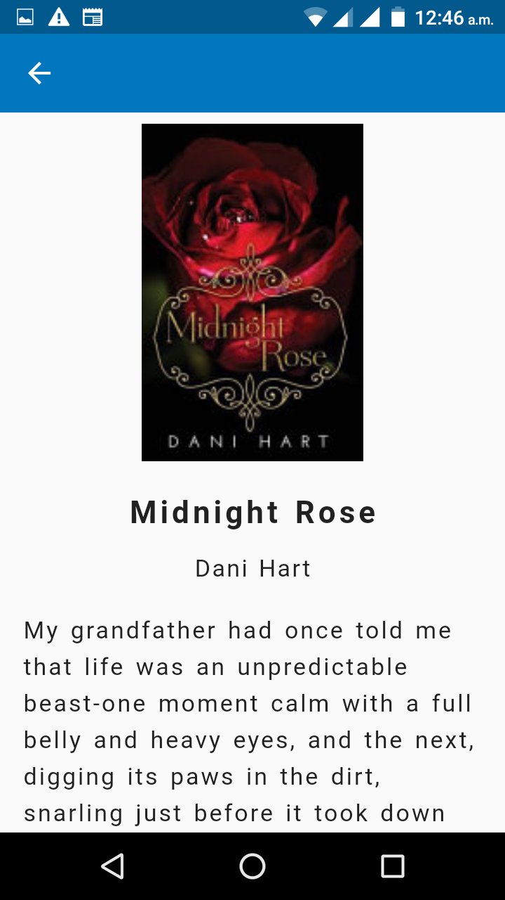

# mobile_book

A flutter application that utilizes Google Books API : [https://developers.google.com/books/docs/v1/using](https://developers.google.com/books/docs/v1/using)

## Screenshots
   

### Features:
- Authentication using [https://my-json-server.typicode.com/vicomo500/FakeJSONServer/users](https://my-json-server.typicode.com/vicomo500/FakeJSONServer/users) & alternatively using fingerprint.
- Registration simulation with the above api endpoint.
- Google Books list with infinite scroll (check out [https://developers.google.com/books/docs/v1/using](https://developers.google.com/books/docs/v1/using)).
- CI/CD with github actions: [https://github.com/features/actions](https://github.com/features/actions)
-------------
NOTE: To run this project
-------
* > register for Google Books api: [https://developers.google.com/books/docs/v1/using](https://developers.google.com/books/docs/v1/using)
* > create a `secrets.json` file in the project's root directory
* > put your api key in format `{"api_key": "xxxxxx"}`
